DIRTY PROJECT - CREDITS TO <a href="https://github.com/rksazid"> MD. Rezaul Karim</a>. His initial Project: <a href="https://github.com/rksazid/PlaneGame-OpenGL-CPP">PlaneGame-OpenGL</a>

# HOCHSCHULE DARMSTADT

## G r a p h i s c h e D a t e n v e r a r b e i t u n g

# Dokumentation - Motorbike Game

### Dokumentationsbericht vom 12.03.2021

Veranstaltung: Graphische Datenverarbeitung
Studiengang: INFORMATIK
Koordinatoren: Prof. Dr. Björn Frömmer
Studierende: Jan Niklas Blanquett (760515)
Loredana-Lavinia Mihut (759509)


## Inhaltsverzeichnis


- 1 Einleitung
- 2 Technische Details
- 3 Spielbeschreibung
- 4 Programmstart
- 5 Modelle
   - 5.1 Driver.cpp Driver.h
   - 5.2 Motorbike.cpp Motorbike.h
   - 5.3 Landscape.cpp Landscape.h
   - 5.4 Text.cpp Text.h
   - 5.5 Cube.cpp Cube.h
- 6 Hauptprogramm
   - 6.1 draw()
   - 6.2 building()
- 6.3 singlebuilding()
- 6.4 mainMenu()
- 6.5 subMenu()
- 6.6 Specialfunc()
- 6.7 environment()
- 6.8 resize()
- 6.9 backgroundcolor()
- 6.10 init()
- 6.11 prepareGametoDisplay()
- 6.12 MouseFunc()
- 6.13 key()
- 6.14 LIGHT
- 6.15 Toggle_fullscreen()


## 1 Einleitung

```
Diese Dokumentation dient als Anleitung / Erklärung des Spiels Motorbike Game
für die alternative Prüfung (Rendering Competition) zum Thema Fahrzeuge im
Fach Graphische Datenverarbeitung im WS2021.
In Rahmen dieses Projekts werden folgende Anforderungen erfühlt:
```
- Kreativität
- einen komplexen, mehrfach verzweigten Szenegraph mit mind. 3 Ebenen
- sinnvolle, abhängige Animationen
- Userinput
- Licht / Beleuchtung
- Texturen

## 2 Technische Details

Entwicklungsumgebung:CLion
Programmiersprache: C++
Betriebssystem: Windows
Benötigte Bibliotheken: FreeGlut / Glut u. Soil (Texturen)
Ausführen des Projekts: um das Projekt in CLion ausführen zu können, benö-
tigt man eine CMake-Datei CMakeList.txt, die folgeden Informationen beinhaltet:


## 3 Spielbeschreibung

Das Motorbike-Game stellt ein einfaches 3D-Spiel dar, in dem ein Motorradfahrer
versucht, möglichst viele BitCoins einzusammeln, ohne die roten Hindernisse, die
Kegeln auf der Straße zu berühren, da in dem Fall das Spiel zu Ende ist.

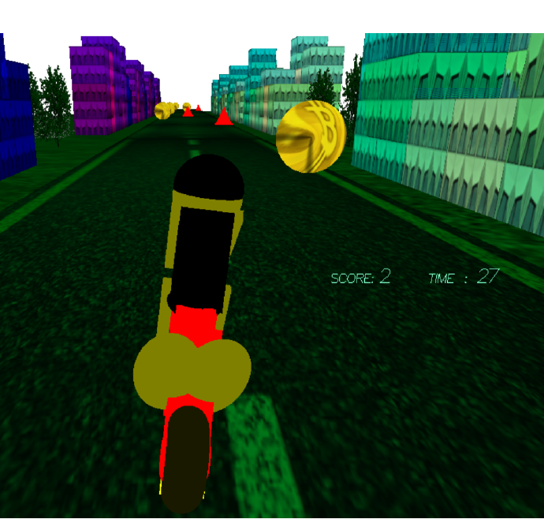


## 4 Programmstart

Beim Ausführen des Programms landet man im Hauptmenü, wo man aufgefordert
wird, eine von zwei Optionen: L für Licht und G für Spielstart auszuwählen.

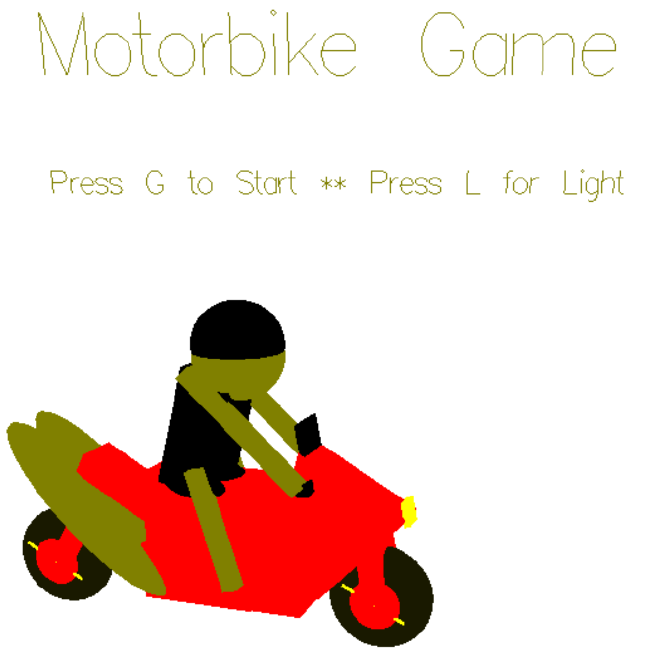

Wird die Option L vom Spieler ausgewählt, so erscheint eine dunkle Szene, die
vom Motorradlichtwerfer rundherum beleuchtet wird (siehe Figure2).


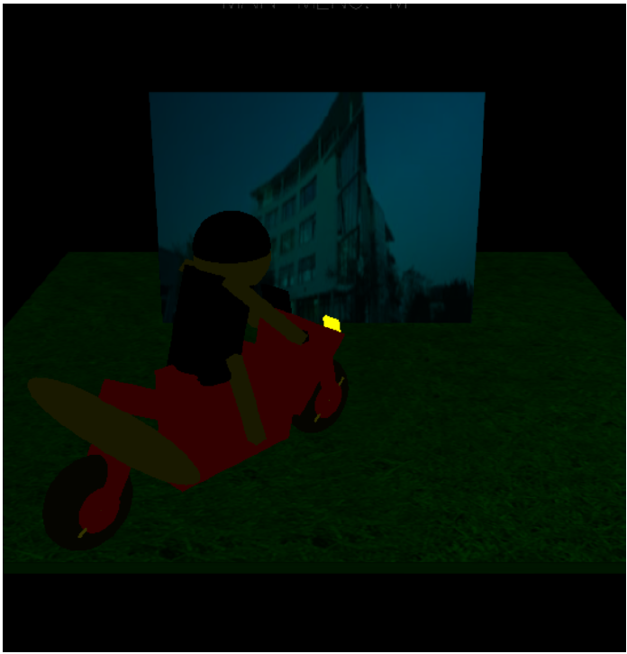

Beim Wählen der Option G (Start Game) wird das tatsächliche Spiel wie in der
Spielbeschreibung angekündigt gestartet.


## 5 Modelle

### 5.1 Driver.cpp Driver.h

Die Klasse Driver wird dafür benutzt, um den Fahrer zu zeichnen. Der dazugehörige
Szenegraph ist unten abgebildet:

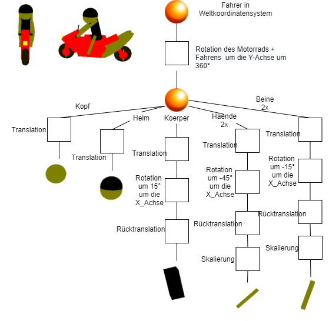

### 5.2 Motorbike.cpp Motorbike.h

Das Motorrad wurde in der Klasse Motorbike.cpp erzeugt. Der Szenegraph ist
unten abgebildet:


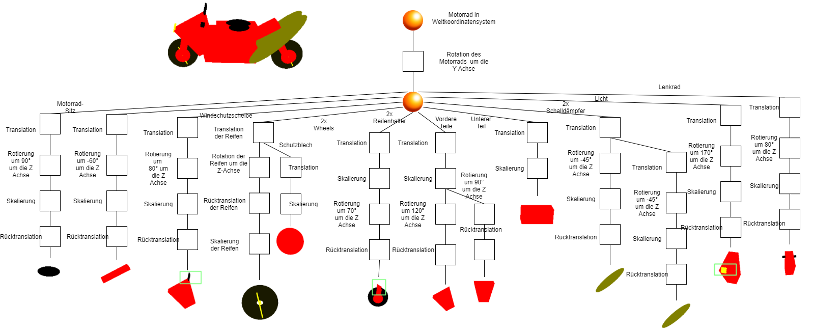


### 5.3 Landscape.cpp Landscape.h

```
In dieser Klasse sind die Funktionen zu finden, die mit dem Zeichen der Landschaft
zu tun haben.
```
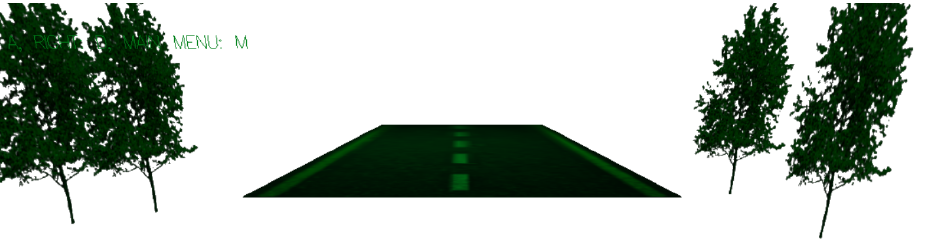

### 5.4 Text.cpp Text.h

In dieser Klasse sind verschiedene Funktionen zu finden, die die Ausgabe von
Text auf dem Bildschirm ermöglichen.

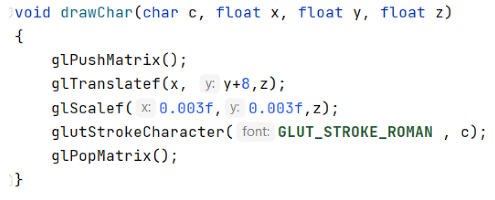

### 5.5 Cube.cpp Cube.h

```
Hier findet man eine Erweiterung der von Dozenten zur Verfügung gestellten
Datei Wuerfel_mit_normalen. Diese beinhaltet Funktionen, die die Verwendung
von Texturen zulässt.
```

## 6 Hauptprogramm

### 6.1 draw()

```
Die Funktion draw() dient dazu den nächsten Frame im Spiel als Bild darzustellen.
Sie wird also fortwährend des Spielablaufes ständig aufgerufen. Einerseits wird
das Motorrad für eine korrekte Position skaliert und anschließend mit der Funktion
drawbike() gezeichnet. Außerdem sorgt sie dafür, dass sich das Motorrad sich
nur zu einer gewissen Weise rotiert. Des Weiteren wird eine Spurbegrenzung des
Motorrads überprüft. Es werden dort die Zeichnungen der Szene entlang der Ferne
in Richtung der Z-Achse hinein festgelegt.Abschließend wird noch überprüft, ob
das Motorrad einen Hinderniskegel oder einen entsprechenden Bitcoin getroffen
hat.
```
### 6.2 building()

Die Funktion building() dient als Vorbereitung für die Funktion singlebuilding().
Mit ihrem Aufruf wird festgelegt, wie oft die Funktion singlebuilding() aufgerufen
wird, also wie viele Häuser nacheinander erstellt werden sollen.

## 6.3 singlebuilding()

```
Die Funktion singlebuildung() dient dazu die Erstellung eines einzelnes Hauses
vorzubereiten. Anfangs wird per Modulo eine Farbrichtung des Hauses ausgewählt.
Mit dem Aufruf der Funktion Wuerfel-TexturBuilding() wird die Textur, die
die Häuser haben sollen übergeben. Dort werden dann mit verschiedenen GL-
POLYGON-Befehlen das konkrete Haus gezeichnet.
```

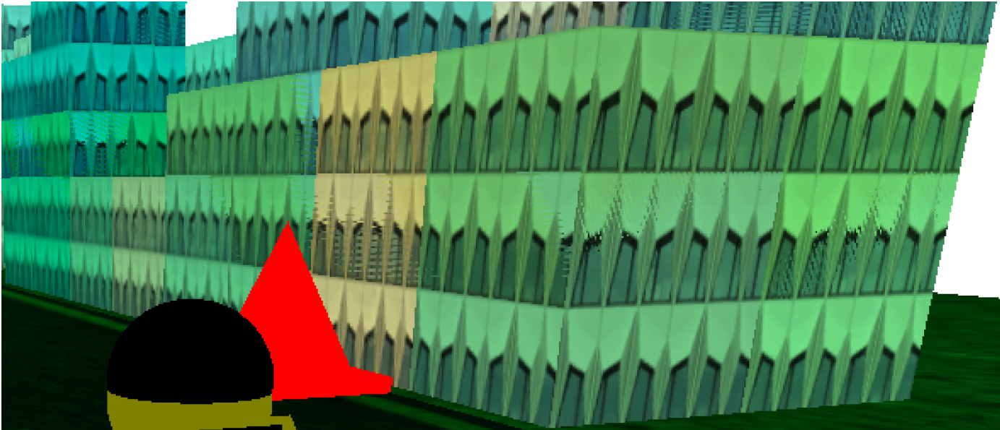

## 6.4 mainMenu()

Die Funktion mainMenu() dient dazu die Optionen der Funktion subMenu()
darzustellen. Sie wird mit einem Rechtsklick dargestellt und man erhält die
Optionen Background Color und Exit zur Auswahl, wie unten dargestellt.

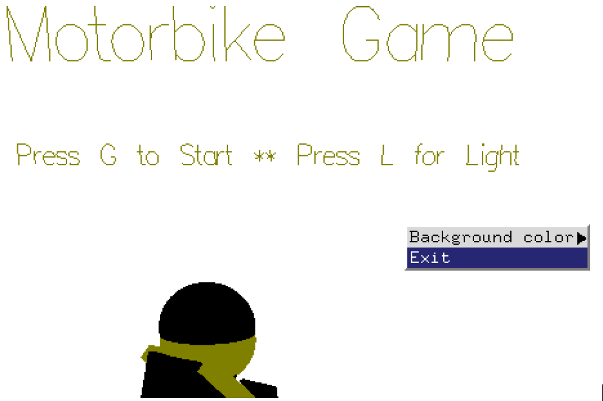

## 6.5 subMenu()

Die Funktion subMenu() dient dazu die entsprechenden Optionen des Menüs,
die sogenannten Labels die zum Untermenüpunkt BackgroundColor und des
Hauptmenüs gehören zu definieren und zu erstellen. Unten zu sehen ist die
Auswahl der Background Farben.

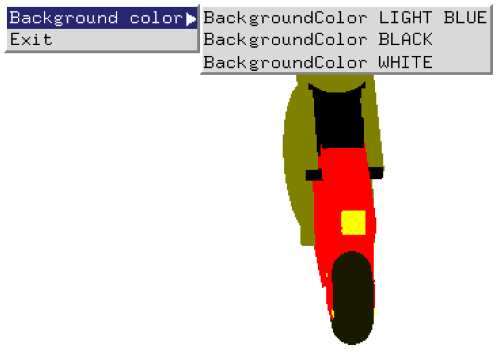

## 6.6 Specialfunc()

Mit der Funktion Specialfunc() werden die Funktions- und Pfeiltasten abgefragt.
Mit den Pfeiltasten Oben, Unten, Links und Rechts wird die Ansicht im Spiel
geändert. Mit Links und Rechts verändert sich die Ansicht in X-Richtung. Mit
Oben und Unten hingegen verändert sich die Ansicht hingegen in Y-Richtung.
Unten ist eine Abbildung zu sehen mit einem maximalen X-Winkel und maximalen
Y-Winkel.


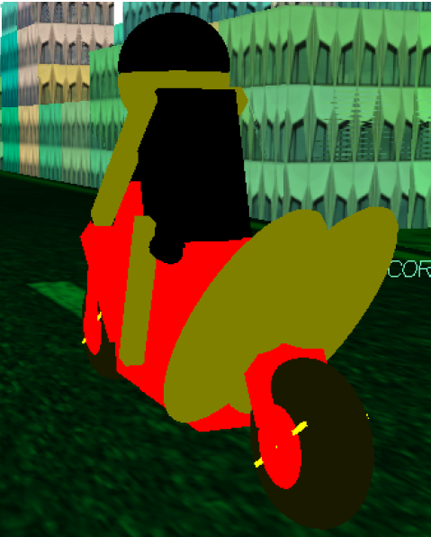


## 6.7 environment()

In der Funktion environment() wird die Umgebung (Hochhäuser, Straße, Grass-
fläche, Bäume, Hindernisse, BitCoins) vorbereitet und angezeigt.

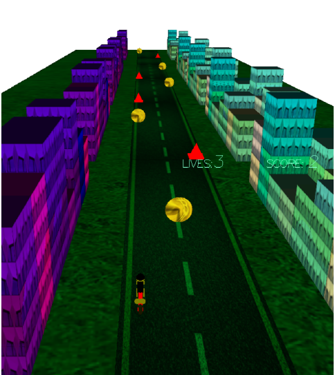


## 6.8 resize()

Damit die Größe der Objekte nicht explizit von der Fenstergröße abhängig gemacht
wird, wurde in der Funktion resize() die Projektionsmatrix angepasst, wenn sich
die Fenstergröße ändert.

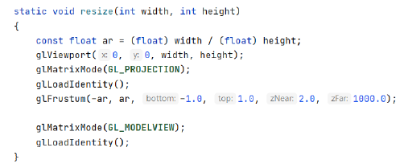

## 6.9 backgroundcolor()

Diese Funktion dient dazu, mittels Mouse-Interaktion die Hintergrundfarbe zu
ändern. Dies wird in einem switch-case Block abgefangen: die Hintergrundfarbe
wird gesetzt und zusätzlich wird einfach ein Flag gesetzt, das glut anweist, den
Display-Rückruf bei der nächsten Schleifeniteration aufzurufen. Es stehen drei
Optinen zur Verfügung: hell blau, schwarz und weiß.

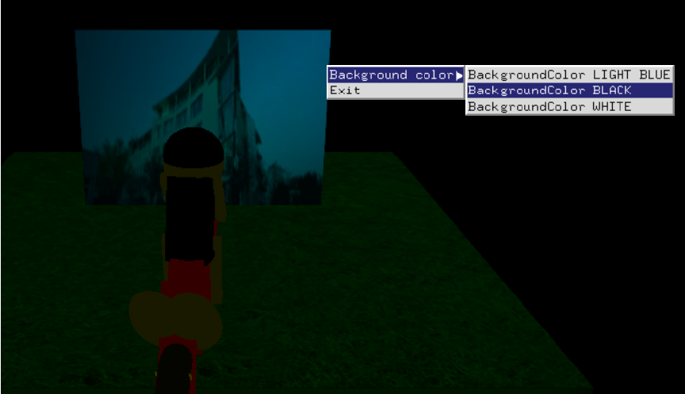

## 6.10 init()

Hier finden jene Aktionen statt, die zum Programmstart einmalig durchgeführt
werden müssen, wiegluOrtho2D - Koordinaten für die linke und rechte vertikale
Schnittebene -glClearDepth- gibt den Tiefenwert an, der von glClear zum Löschen
des Tiefenpuffers verwendet wird - und das einmalige Laden von Texturen:


## 6.11 prepareGametoDisplay()

Mittels dieser Funktion wurde das Menu im Programm eingebaut. Der Benutzer
hat die Möglichkeit zwischen Hauptmenu/Startseite, Lichtszene und Spiel hin
und her zu wechseln. Der Wechsel erfolgt mittels Tastatureingaben:

- M- Startseite
- G- Spielstart
- L- Lichtszene

## 6.12 MouseFunc()

Durch rechten Mouse-Click kann der Spieler zwischen Hintergrundfarbe ändern
oder Programm beenden auswählen.

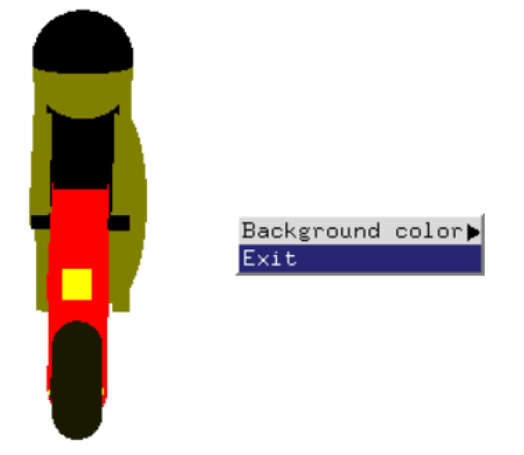


## 6.13 key()

Der Userinput mittels Tastatureingaben wird wie folgt ermöglicht:

- q:das Programm wird sofort beendet
- r:Rotation um 360°um die ganze Szene herum
- t:Beenden der Rotation
- z:hineinzoomen
- Z:hinauszoomen
- a:Lenken des Motorrads nach links
- d:Lenken des Motorrads nach rechts
- g:Starten des Spiels
- f:Switchen zwischen Vollbild- und Normalbildmodus
- m:zurück zum Hauptmenüseite
- l:zur Lichtszene navigieren


## 6.14 LIGHT

```
Für die Beleuchtung der Szene wurden die folgenden konstanten Variablen erzeugt
und initialisiert:
```
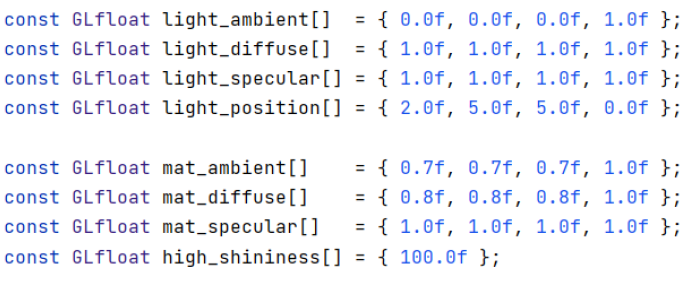

Mittels den OpenGl-Funktionen werden die Lichter aktiviert glEna-
ble(GL_LIGHT0) u. glEnable(GL_LIGHTING). glLight setzt die verschiedenen
Eigenschaften einer Lichtquelle. Die Lichtquelle wird über den Parameter light
bestimmt und ist ein symbolischer Name der Form: GL_LIGHTi wobei 0 <= i
< GL_MAX_LIGHTS ist.

```
Um die automatische Normalisierung zu aktivieren, wird glEna-
ble(GL_NORMALIZE)verwendet. WennglEnable(GL_COLOR_MATERIAL)
aktiviert ist, beinflussen die Eigenschaften, die über Mode angegeben wurden,
der Seiten, die über Face gewählt wurden, die aktuelle Farbe über die ganze Zeit.
```
## 6.15 Toggle_fullscreen()

```
Wie der Name schon verrät, wird diese Funktion benutzt, um mithilfe der Drück-
taste F zwischen einer Vollanzeige und normaler Bildschirmgröße hin- und herzu-
schalten.
```
